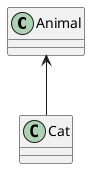

# Hugo系列(3.2) - LoveIt主题美化与博客功能增强 · 第三章

## 前言

本博客使用的是Hugo的LoveIt主题，本文也是基于该主题而写的，不过Hugo的美化步骤应该大同小异，版本如下：
```
hugo: v0.74.2/extended windows/amd64 BuildDate: unknown

LoveIt: v0.2.10
```

**请注意，本文的所有功能都离不开两个新增加的文件：`_custom.scss`和`custom.js`，部分功能还需要`jquery`，在第一章中会提及如何引入。**

另外本文篇幅太长，阅读体验不好，将其进行分章如下：

* [Hugo系列(3.0) - LoveIt主题美化与博客功能增强 · 第一章](/posts/hugo-3.html/)
* [Hugo系列(3.1) - LoveIt主题美化与博客功能增强 · 第二章](/posts/hugo-3.1.html/)
* [Hugo系列(3.2) - LoveIt主题美化与博客功能增强 · 第三章](/posts/hugo-3.2.html/)
* [Hugo系列(3.3) - LoveIt主题美化与博客功能增强 · 第四章](/posts/hugo-3-3/)

<!--more-->

## 添加归档、分类页面里的文章数量统计

### 在list.html里添加`sup`标签

文章数量统计实际上就是添加html里的`sup`标签，借助hugo提供的变量来获取对应的文章数量，即可实现该功能。

拷贝`\themes\LoveIt\layouts\taxonomy\list.html`到`\layouts\taxonomy\list.html`，打开拷贝后的文件，找到如下内容：
```
{{- if eq $taxonomy "category" -}}
    <i class="far fa-folder-open fa-fw"></i>&nbsp;{{ .Title }}
{{- else if eq $taxonomy "tag" -}}
    <i class="fas fa-tag fa-fw"></i>&nbsp;{{ .Title }}
{{- else -}}
```

改成如下：
```
{{- if eq $taxonomy "category" -}}
    <i class="far fa-folder-open fa-fw"></i>&nbsp;{{ .Title }}<sup>{{ len .Pages }}</sup>
{{- else if eq $taxonomy "tag" -}}
    <i class="fas fa-tag fa-fw"></i>&nbsp;{{ .Title }}<sup>{{ len .Pages }}</sup>
{{- else -}}
```

继续找到如下内容：
```
{{- range $pages.PageGroups -}}
    <h3 class="group-title">{{ .Key }}</h3>
```

改成如下：
```
{{- range $pages.PageGroups -}}
    <h3 class="group-title">{{ .Key }} <sup>{{ len .Pages }}</sup></h3>
```

原本主题的文章是按照年份来分组的，如果想按照月份来分组，找到下面的内容：
```
{{- /* Paginate */ -}}
{{- if .Pages -}}
    {{- $pages := .Pages.GroupByDate "2006" -}}
```

改成如下：
```
{{- /* Paginate */ -}}
{{- if .Pages -}}
    {{- $pages := .Pages.GroupByDate "2006-01" -}}
```

### 在terms.html里添加`sup`标签

拷贝`\themes\LoveIt\layouts\taxonomy\terms.html`到`\layouts\taxonomy\terms.html`，打开拷贝后的文件，找到如下内容：
```
<div class="page archive">
    {{- /* Title */ -}}
    <h2 class="single-title animated pulse faster">
        {{- .Params.Title | default (T $taxonomies) | default $taxonomies | dict "Some" | T "allSome" -}}
    </h2>
```

改成如下：
```
<div class="page archive">
    {{- /* Title */ -}}
    <h2 class="single-title animated pulse faster">
        {{- .Params.Title | default (T $taxonomies) | default $taxonomies | dict "Some" | T "allSome" -}}<sup>{{ len .Pages }}</sup>
    </h2>
```

找到如下内容：
```
<h3 class="card-item-title">
    <a href="{{ .RelPermalink }}">
        <i class="far fa-folder fa-fw"></i>&nbsp;{{ .Page.Title }}
    </a>
</h3>
```

改成如下：
```
<h3 class="card-item-title">
    <a href="{{ .RelPermalink }}">
        <i class="far fa-folder fa-fw"></i>&nbsp;{{ .Page.Title }} <sup>{{ len .Pages }}</sup>
    </a>
</h3>
```

### 在section.html里添加`sup`标签

拷贝`\themes\LoveIt\layouts\_default\section.html`到`\layouts\_default\section.html`，打开拷贝后的文件，找到如下内容：
```
<div class="page archive">
    {{- /* Title */ -}}
    <h2 class="single-title animated pulse faster">
        {{- .Params.Title | default (T .Section) | default .Section | dict "Some" | T "allSome" -}}
    </h2>
```

改成如下：
```
<div class="page archive">
    {{- /* Title */ -}}
    <h2 class="single-title animated pulse faster">
        {{- .Params.Title | default (T .Section) | default .Section | dict "Some" | T "allSome" -}}<sup>{{ len .Pages }}</sup>
    </h2>
```

找到如下内容：
```
{{- range $pages.PageGroups -}}
            <h3 class="group-title">{{ .Key }}</h3>
```

改成如下：
```
{{- range $pages.PageGroups -}}
    <h3 class="group-title">{{ .Key }} <sup>{{ len .Pages }}</sup></h3>
```

这里同样是按照年份来分组的，如果想按照月份来分组，找到下面的内容：
```
{{- /* Paginate */ -}}
{{- if .Pages -}}
    {{- $pages := .Pages.GroupByDate "2006" -}}
```

改成如下：
```
{{- /* Paginate */ -}}
{{- if .Pages -}}
    {{- $pages := .Pages.GroupByDate "2006-01" -}}
```

## 修改侧边栏目录样式

默认侧边栏的目录是全展开的，如果文章太长，小标题太多，就会导致目录非常长，看起来不方便。可以改成只展开当前正在查看的小标题对应的目录，在`_custom.scss`里添加如下样式：
```css
/* 目录 */
nav#TableOfContents ol {
    padding-inline-start: 30px;

    & ol {
        padding-inline-start: 25px;
        display: none;
    }

    & li.has-active ol {
        display: block;
    }
}
```

## 添加文章过期提醒

### 配置文件添加相关变量

在`config.toml`添加如下变量：
```
  # Display a message at the beginning of an article to warn the readers that it's content may be outdated.
  # 在文章末尾显示提示信息，提醒读者文章内容可能过时。
  [params.outdatedInfoWarning]
    enable = true
    hint = 90     # Display hint if the last modified time is more than these days ago.    # 如果文章最后更新于这天数之前，显示提醒
    warn = 180    # Display warning if the last modified time is more than these days ago.    # 如果文章最后更新于这天数之前，显示警告
```

这里是对全局文章生效，也可以在每篇文章的文件头里添加如下变量来控制是否启用该功能：
```
outdatedInfoWarning: false
```

### 添加变量到国际化文件

将`\themes\LoveIt\i18n\zh-CN.toml`拷贝到`\i18n\zh-CN.toml`，然后将该文件重命名为`zh-cn.toml`。因为站点配置文件里的中文语言代码应该是全小写的`zh-cn`，如下：
```
defaultContentLanguage = "zh-cn"
```

打开拷贝后的文件，添加如下内容：
```
[outdatedInfoWarningBefore]
  other = "本文最后更新于 "

[outdatedInfoWarningAfter]
  other = "，文中内容可能已过时，请谨慎使用。"
```

如果你的国际化文件是用的`yaml`格式，则如下：
```
outdatedInfoWarningBefore:
  other: "本文最后更新于 "

outdatedInfoWarningAfter:
  other: "，文中内容可能已过时，请谨慎使用。"
```

如果有配置了其他语言，可以添加上面两个变量到对应的国际化文件里，自行修改`other`所对应的值即可。

### 添加模板文件`outdated-info-warning.html`

新建模板文件`/layouts/partials/single/outdated-info-warning.html`，内容如下：
```
{{- if or .Params.outdatedInfoWarning (and .Site.Params.outdatedInfoWarning.enable (ne .Params.outdatedInfoWarning false)) }}
  {{- $daysAgo := div (sub now.Unix .Lastmod.Unix) 86400 }}
  {{- $hintThreshold := .Site.Params.outdatedInfoWarning.hint | default 30 }}
  {{- $warnThreshold := .Site.Params.outdatedInfoWarning.warn | default 180 }}

  {{- $updateTime := .Lastmod }}
  {{- if .GitInfo }}
    {{- if lt .GitInfo.AuthorDate.Unix .Lastmod.Unix }}
      {{- $updateTime := .GitInfo.AuthorDate }}
    {{- end }}
  {{- end -}}

  {{- if gt $daysAgo $hintThreshold }}
	{{- $iconDetails := "fas fa-angle-right fa-fw" -}}
    {{- if gt $daysAgo $warnThreshold }}
		{{- $type := "warning" -}}
		{{- $icon := "fas fa-exclamation-triangle fa-fw" -}}
		<div class="details admonition {{ $type }} open">
			<div class="details-summary admonition-title">
				<i class="icon {{ $icon }}{{ $type }}"></i>{{ T $type }}<i class="details-icon {{ $iconDetails }}"></i>
	{{- else }}
		{{- $type := "note" -}}
		{{- $icon := "fas fa-pencil-alt fa-fw" -}}
		<div class="details admonition {{ $type }} open">
			<div class="details-summary admonition-title">
				<i class="icon {{ $icon }}{{ $type }}"></i>{{ T $type }}<i class="details-icon {{ $iconDetails }}"></i>
    {{- end }}
		    </div>
			<div class="details-content">
				<div class="admonition-content">
					{{ T "outdatedInfoWarningBefore" -}}
					<span class="timeago" datetime="{{ dateFormat "2006-01-02T15:04:05" $updateTime }}" title="{{ dateFormat "January 2, 2006" $updateTime }}">
					{{- dateFormat "January 2, 2006" $updateTime -}}
					</span>{{ T "outdatedInfoWarningAfter" -}}
				</div>
			</div>
		 </div>
  {{- end -}}
{{- end -}}
```

### 修改模板文件`single.html`

将`/themes/LoveIt/layouts/posts/single.html`拷贝到`/layouts/posts/single.html`，打开拷贝后的文件，找到如下内容：
```
{{- /* Content */ -}}
<div class="content" id="content">
    {{- dict "Content" .Content "Ruby" $params.ruby "Fraction" $params.fraction "Fontawesome" $params.fontawesome | partial "function/content.html" | safeHTML -}}
</div>
```

修改成如下：
```
<div class="content" id="content">
    {{- dict "Content" .Content "Ruby" $params.ruby "Fraction" $params.fraction "Fontawesome" $params.fontawesome | partial "function/content.html" | safeHTML -}}
	
	{{- /* Outdated Info Warning */ -}}
	{{- partial "single/outdated-info-warning.html" . -}}
</div>
```

## 菜单栏支持子菜单

### 修改模板代码

将主题的`/themes/LoveIt/layouts/partials/header.html`拷贝一份到`layouts/partials/header.html`，找到如下代码，一共有两个地方，分别对应网页端和手机端：
```
{{- range .Site.Menus.main -}}
    {{- $url := .URL | relLangURL -}}
    {{- with .Page -}}
        {{- $url = .RelPermalink -}}
    {{- end -}}
    <a class="menu-item{{ if $.IsMenuCurrent `main` . | or ($.HasMenuCurrent `main` .) | or (eq $.RelPermalink $url) }} active{{ end }}" href="{{ $url }}"{{ with .Title }} title="{{ . }}"{{ end }}{{ if (urls.Parse $url).Host }} rel="noopener noreffer" target="_blank"{{ end }}>
        {{- .Pre | safeHTML }} {{ .Name }} {{ .Post | safeHTML -}}
    </a>
{{- end -}}
```

将上述代码改为如下代码：

```
{{- range .Site.Menus.main -}}
	{{ if .HasChildren }}
		<div class="dropdown">
			<a {{ if .URL }}href="{{ .URL }}"{{ else }}href="javascript:void(0);"{{ end }} class="menu-item menu-more dropbtn" title="{{ .Title }}" {{ if eq .Post "_blank" }}target="_blank" rel="noopener"{{ end }}>
				{{- .Pre | safeHTML }} {{ .Name }} {{ if ne .Post "_blank" }}{{ .Post | safeHTML -}}{{ end }}
			</a>
			<div class="menu-more-content dropdown-content">
				{{- range .Children -}}
					{{- $url := .URL | relLangURL -}}
					{{- with .Page -}}
						{{- $url = .RelPermalink -}}
					{{- end -}}
						<a href="{{ $url }}" title="{{ .Title }}" {{ if eq .Post "_blank" }}target="_blank" rel="noopener"{{ end }}>{{- .Pre | safeHTML }} {{ .Name }} {{ if ne .Post "_blank" }}{{ .Post | safeHTML -}}{{ end }}</a>
				{{- end -}}
			</div>
		</div>
	{{ else }}
		{{- $url := .URL | relLangURL -}}
		{{- with .Page -}}
			{{- $url = .RelPermalink -}}
		{{- end -}}
		<a class="menu-item{{ if $.IsMenuCurrent `main` . | or ($.HasMenuCurrent `main` .) | or (eq $.RelPermalink $url) }} active{{ end }}" href="{{ $url }}"{{ with .Title }} title="{{ . }}"{{ end }}{{ if (urls.Parse $url).Host }} rel="noopener noreffer" target="_blank"{{ end }}>
			{{- .Pre | safeHTML }} {{ .Name }} {{ if ne .Post "_blank" }}{{ .Post | safeHTML -}}{{ end }}
		</a>
	{{- end -}}
{{- end -}}
```

### 添加css样式

在`_custom.scss`中添加如下代码：
```
/* 子菜单栏 */
.dropdown {
  display: inline-block;
}

/* 子菜单的内容 (默认隐藏) */
.dropdown-content {
  display: none;
  position: absolute;
  background-color: #f9f9f9;
  box-shadow: 0px 8px 16px 0px rgba(0, 0, 0, 0.2);
  border-radius: 4px;
  line-height: 1.3rem;
}

/* 子菜单的链接 */
.dropdown-content a {
  padding: 10px 18px 10px 14px;
  text-decoration: none;
  display: block;
  & i {
    margin-right: 3px;
  }
}

/* 鼠标移上去后修改子菜单链接颜色 */
.dropdown-content a:hover {
  background-color: #f1f1f1;
  border-radius: 4px;
}

/* 在鼠标移上去后显示子菜单 */
.dropdown:hover .dropdown-content {
  display: block;
}

@media screen and (max-width: 680px) {
    .dropdown {
      display: inline;
    }
  .dropdown:hover .dropdown-content {
    display: inline;
    z-index: 1;
    margin-top: -2em;
    margin-left: 3em;
  }
  .dropdown-content a:hover {
    background-color: transparent;
  }
}
```

### 配置子菜单

打开站点配置文件`config.toml`，添加子菜单到菜单栏里。子菜单其实和原本的菜单一样写法，只是多了一个`parent`属性，用来定位到对应的父菜单的`identifier`。下面是一个简单的子菜单定义方式（没有使用多语言功能）：
```
# 菜单配置
[menu]
  [[menu.main]]
    identifier = "posts"
    # 你可以在名称 (允许 HTML 格式) 之前添加其他信息, 例如图标
    pre = "<i class='fas fa-fw fa-archive'></i>"
    # 你可以在名称 (允许 HTML 格式) 之后添加其他信息, 例如图标
    post = ""
    name = "归档"
    url = "/posts/"
    title = ""
    weight = 1
  [[menu.main]]
    pre = "<i class='fas fa-fw fa-link'></i>"
    name = "友链"
    identifier = "friends"
    url = "/friends/"
    weight = 2

  # 二级菜单
  [[menu.main]]
    parent = "posts"
    pre = "<i class='fas fa-fw fa-th'></i>"
    name = "分类"
    identifier = "categories"
    url = "/categories/"
    weight = 1
  [[menu.main]]
    parent = "posts"
	identifier = "tags"
    pre = "<i class='fas fa-fw fa-tag'></i>"
    post = "_blank"
	name = "标签"
	url = "/tags/"
	title = ""
	weight = 2
```

菜单栏还允许以下配置：
* 通过给菜单配置一个`post = "_blank"`属性来将该菜单设置为在新窗口打开该链接，如果`post`属性填其他值则依然作为原本的功能使用：即给`name`添加后缀。
* 通过设置`title`来添加超链的提示文本。
* 父菜单可以通过将`url`设置为空来将其渲染为不跳转的超链：`url = ""`。

## 添加文章打赏

### 配置文件添加相关变量

在`config.toml`添加如下变量：
```
  [params.reward]                                  # 文章打赏
    enable = true
    wechat = "/images/wechat.png"           # 微信二维码
    alipay = "/images/alipay.png"           # 支付宝二维码

```

这里是对全局文章生效，也可以在每篇文章的文件头里添加如下变量来控制是否启用该功能：
```
reward: false
```

至于微信和支付宝的收款码，如果不想用官方提供的样式，可以参考这篇文章：[微信支付宝收款码制作和美化如何做？](http://blog.sina.com.cn/s/blog_76f1a1430102yxff.html)

### 添加变量到国际化文件

将`\themes\LoveIt\i18n\zh-CN.toml`拷贝到`\i18n\zh-CN.toml`，然后将该文件重命名为`zh-cn.toml`。因为站点配置文件里的中文语言代码应该是全小写的`zh-cn`，如下：
```
defaultContentLanguage = "zh-cn"
```

打开拷贝后的文件，添加如下内容：
```
[reward]
  other = "赞赏支持"

[rewardAlipay]
  other = "支付宝打赏"

[rewardWechat]
  other = "微信打赏"
```

如果你的国际化文件是用的`yaml`格式，则如下：
```
reward:
  other: "赞赏支持"

rewardAlipay:
  other: "支付宝打赏"

rewardWechat:
  other: "微信打赏"
```

如果有配置了其他语言，可以添加上面两个变量到对应的国际化文件里，自行修改`other`所对应的值即可。

### 添加模板文件`reward.html`

新建模板文件`/layouts/partials/single/reward.html`，内容如下：
```
{{ if or .Params.reward (and .Site.Params.reward.enable (ne .Params.reward false)) -}}
<div class="post-reward">
  <input type="checkbox" name="reward" id="reward" hidden />
  <label class="reward-button" for="reward">{{ T "reward" }}</label>
  <div class="qr-code">
    {{ $qrCode := .Site.Params.reward }}
	{{- $cdnPrefix := .Site.Params.cdnPrefix -}}
    {{ with $qrCode.wechat -}}
      <label class="qr-code-image" for="reward">
        
        <span>{{ T "rewardWechat" }}</span>
      </label>
    {{- end }}
    {{ with $qrCode.alipay -}}
      <label class="qr-code-image" for="reward">
        
        <span>{{ T "rewardAlipay" }}</span>
      </label>
    {{- end }}
  </div>
</div>
{{- end }}
```

### 修改模板文件`single.html`

将`/themes/LoveIt/layouts/posts/single.html`拷贝到`/layouts/posts/single.html`，打开拷贝后的文件，找到如下内容：
```
{{- /* Content */ -}}
<div class="content" id="content">
    {{- dict "Content" .Content "Ruby" $params.ruby "Fraction" $params.fraction "Fontawesome" $params.fontawesome | partial "function/content.html" | safeHTML -}}
</div>
```

修改成如下：
```
{{- /* Content */ -}}
<div class="content" id="content">
    {{- dict "Content" .Content "Ruby" $params.ruby "Fraction" $params.fraction "Fontawesome" $params.fontawesome | partial "function/content.html" | safeHTML -}}

	{{- /* Reward */ -}}
	{{- partial "single/reward.html" . -}}
</div>
```

### 添加css代码

在自定义的`_custom.scss`里添加如下样式：
```css
/* 打赏 */
article .post-reward {
    margin-top: 20px;
    padding-top: 10px;
    text-align: center;
    border-top: 1px dashed #e6e6e6
}

article .post-reward .reward-button {
    margin: 15px 0;
    padding: 3px 7px;
    display: inline-block;
    color: #c05b4d;
    border: 1px solid #c05b4d;
    border-radius: 5px;
    cursor: pointer
}

article .post-reward .reward-button:hover {
    color: #fefefe;
    background-color: #c05b4d;
    transition: .5s
}

article .post-reward #reward:checked~.qr-code {
    display: block
}

article .post-reward #reward:checked~.reward-button {
    display: none
}

article .post-reward .qr-code {
    display: none
}

article .post-reward .qr-code .qr-code-image {
    display: inline-block;
    min-width: 200px;
    width: 40%;
    margin-top: 15px
}

article .post-reward .qr-code .qr-code-image span {
    display: inline-block;
    width: 100%;
    margin: 8px 0
}

article .post-reward .qr-code .image {
    width: 200px;
    height: 200px
}
```

## 添加打赏榜

全文新增了[文章打赏的功能](https://lewky.cn/posts/hugo-3.2.html/#添加文章打赏)，这里添加一个新的页面来记录老板们的打赏和红包，用的是响应式垂直时间轴。

### 配置文件添加子菜单

这里使用了菜单栏的子菜单配置，子菜单的做法请参考[前文](https://lewky.cn/posts/hugo-3.2.html/#菜单栏支持子菜单)。

```
  [[menu.main]]
    parent = "posts"
    pre = "<i class='fas fa-fw fa-donate'></i>"
    name = "打赏"
    title = "感谢打赏，老板大气~"
    identifier = "donation"
    url = "/donation/"
    weight = 4
```

### 添加模板文件`donation.html`

新建模板文件`/layouts/shortcodes/donation.html`，内容如下：

```
{{ if .IsNamedParams }}
{{- $cdn := .Site.Params.cdnPrefix -}}
{{- $name := .Get "name" -}}
	<div class="cd-timeline-block">
	{{- if eq $name "wechat" -}}
		<div class="cd-timeline-img cd-wechat">
		  
		</div>
	{{- else if eq $name "alipay" -}}
		<div class="cd-timeline-img cd-alipay">
		  
		</div>
	{{- end -}}
	<div class="cd-timeline-content {{ .Get "name" }}">
	  <p><b>{{ .Get "title" }}</b></p>
	  <p>{{ .Get "description" }}</p>
	  <a href={{ .Get "url" }} class="cd-read-more" target="_blank">阅读被打赏文章</a>
	  <span class="cd-date">{{ .Get "date" }}</span>
	</div>
	</div>
{{ end }}
```

### 新增css样式文件和图片

新建`/static/css/timeline.style.css`，内容如下：

```css
/* -------------------------------- 

Primary style

-------------------------------- */
html * {
  -webkit-font-smoothing: antialiased;
  -moz-osx-font-smoothing: grayscale;
}

*, *:after, *:before {
  -webkit-box-sizing: border-box;
  -moz-box-sizing: border-box;
  box-sizing: border-box;
}

body {
  font-size: 100%;
  background-color: #e9f0f5;
}

footer {
  padding-bottom: 3rem;
}

img {
  max-width: 100%;
}

/* -------------------------------- 

Modules - reusable parts of our design

-------------------------------- */
.cd-container {
  /* this class is used to give a max-width to the element it is applied to, and center it horizontally when it reaches that max-width */
  width: 90%;
  max-width: 1170px;
  margin: 0 auto;
}
.cd-container::after {
  /* clearfix */
  content: '';
  display: table;
  clear: both;
}

/* -------------------------------- 

Main components 

-------------------------------- */

#cd-timeline {
  position: relative;
  padding: 2em 0;
  margin-top: 0;
  margin-bottom: 0;
}
#cd-timeline::before {
  /* this is the vertical line */
  content: '';
  position: absolute;
  top: 0;
  left: 18px;
  height: 100%;
  width: 4px;
  background: #d7e4ed;
}
@media only screen and (min-width: 1170px) {
  #cd-timeline {
    margin-top: 0;
    margin-bottom: 0;
  }
  #cd-timeline::before {
    left: 50%;
    margin-left: -2px;
  }
}

.cd-timeline-block {
  position: relative;
  margin: 2em 0;
}
.cd-timeline-block:after {
  content: "";
  display: table;
  clear: both;
}
.cd-timeline-block:first-child {
  margin-top: 0;
}
.cd-timeline-block:last-child {
  margin-bottom: 0;
}
@media only screen and (min-width: 1170px) {
  .cd-timeline-block {
    margin: 4em 0;
  }
  .cd-timeline-block:first-child {
    margin-top: 0;
  }
  .cd-timeline-block:last-child {
    margin-bottom: 0;
  }
}

.cd-timeline-img {
  position: absolute;
  top: 0;
  left: 0;
  width: 40px;
  height: 40px;
  border-radius: 50%;
  box-shadow: 0 0 0 4px #e9f0f5, inset 0 2px 0 rgba(0, 0, 0, 0.08), 0 3px 0 4px rgba(0, 0, 0, 0.05);
}
.cd-timeline-img img {
  display: block;
  width: 24px;
  height: 24px;
  position: relative;
  left: 50%;
  top: 50%;
  margin-left: -12px;
  margin-top: -12px;
}
.cd-timeline-img.cd-wechat {
  background: #75ce66;
}
.cd-timeline-img.cd-alipay {
  background: #3e8af4;
}
.cd-timeline-img.cd-location {
  background: #f0ca45;
}
@media only screen and (min-width: 1170px) {
  .cd-timeline-img {
    width: 60px;
    height: 60px;
    left: 50%;
    margin-left: -30px;
    /* Force Hardware Acceleration in WebKit */
    -webkit-transform: translateZ(0);
    -webkit-backface-visibility: hidden;
  }
  .cssanimations .cd-timeline-img.is-hidden {
    visibility: hidden;
  }
  .cssanimations .cd-timeline-img.bounce-in {
    visibility: visible;
    -webkit-animation: cd-bounce-1 0.6s;
    -moz-animation: cd-bounce-1 0.6s;
    animation: cd-bounce-1 0.6s;
  }
}

.cd-timeline-content {
  position: relative;
  margin-left: 60px;
  border-radius: 0.25em;
  padding: 1em;
  box-shadow: 0 3px 0 #d7e4ed;
}
.cd-timeline-content:after {
  content: "";
  display: table;
  clear: both;
}
.cd-timeline-content {
  color: #303e49;
}
.cd-timeline-block .wechat{
  background: #75ce66;
}
.cd-timeline-block .alipay{
  background: #3e8af4;
}
.cd-timeline-content p, .cd-timeline-content .cd-read-more, .cd-timeline-content .cd-date {
  font-size: 13px;
  font-size: 0.8125rem;
}
.cd-timeline-content .cd-read-more, .cd-timeline-content .cd-date {
  display: inline-block;
}
.cd-timeline-content p {
  margin: 1em 0;
  line-height: 1.6;
}
.cd-timeline-content .cd-read-more {
  float: right;
  padding: .8em 1em;
  background: white;
  color: #999 !important;
  border-radius: 0.25em;
}
.no-touch .cd-timeline-content .cd-read-more:hover {
  background-color: #bac4cb;  
}
a.cd-read-more:hover{text-decoration:none; background-color: #424242;  }
.cd-timeline-content .cd-date {
  float: left;
  padding: .8em 0;
  opacity: .7;
  color: black;
}
.cd-timeline-content::before {
  content: '';
  position: absolute;
  top: 16px;
  right: 100%;
  height: 0;
  width: 0;
  border: 7px solid transparent;
  border-right: 7px solid white;
}
@media only screen and (min-width: 768px) {
  .cd-timeline-content {
    font-size: 20px;
    font-size: 1.25rem;
  }
  .cd-timeline-content p {
    font-size: 16px;
    font-size: 1rem;
  }
  .cd-timeline-content .cd-read-more, .cd-timeline-content .cd-date {
    font-size: 14px;
    font-size: 0.875rem;
  }
}
@media only screen and (min-width: 1170px) {
  .cd-timeline-content {
    margin-left: 0;
    padding: 1em;
    width: 45%;
  }
  .cd-timeline-content::before {
    top: 24px;
    left: 100%;
    border-color: transparent;
    border-left-color: white;
  }
  .cd-timeline-content .cd-read-more {
    float: left;
  }
  .cd-timeline-content .cd-date {
    position: absolute;
    width: 100%;
    left: 122%;
    top: 6px;
    font-size: 16px;
    font-size: 1rem;
  }
  .cd-timeline-block .wechat{
    background: #75ce66;
  }
  .cd-timeline-block .alipay{
    background: #3e8af4;
  }
  .cd-timeline-block:nth-child(even) .cd-timeline-content {
    float: right;
  }
  .cd-timeline-block:nth-child(even) .cd-timeline-content::before {
    top: 24px;
    left: auto;
    right: 100%;
    border-color: transparent;
    border-right-color: white;
  }
  .cd-timeline-block:nth-child(even) .cd-timeline-content .cd-read-more {
    float: right;
  }
  .cd-timeline-block:nth-child(even) .cd-timeline-content .cd-date {
    left: auto;
    right: 122%;
    text-align: right;
  }
  .cssanimations .cd-timeline-content.is-hidden {
    visibility: hidden;
  }
  .cssanimations .cd-timeline-content.bounce-in {
    visibility: visible;
    -webkit-animation: cd-bounce-2 0.6s;
    -moz-animation: cd-bounce-2 0.6s;
    animation: cd-bounce-2 0.6s;
  }
}

@media only screen and (min-width: 1170px) {
  /* inverse bounce effect on even content blocks */
  .cssanimations .cd-timeline-block:nth-child(even) .cd-timeline-content.bounce-in {
    -webkit-animation: cd-bounce-2-inverse 0.6s;
    -moz-animation: cd-bounce-2-inverse 0.6s;
    animation: cd-bounce-2-inverse 0.6s;
  }
}
```

此外还需要新增两个图片：

`/static/images/common/alipay.svg`和`/static/images/common/wechat.svg`，这两个图片可以从下面的路径里获取到，请自行下载。

* https://cdn.jsdelivr.net/gh/lewky/lewky.github.io@master/images/common/

### 新建donation页面

新建`/content/donation/index.md`，内容如下：

```
---
title: "打赏榜"
date: 2021-08-23T22:01:44+08:00
lastmod: 2021-08-23T22:01:44+08:00
---
<link rel="stylesheet" href="/css/timeline.style.css" />

<section id="cd-timeline" class="cd-container">





</section>
```

该页面首先需要引入css样式文件，然后是添加一个`section`标签，我们的打赏片段需要在`section`标签里通过一个个的`donation`短代码来引入。

上文中的`donation`短代码有五个属性。

`name`有两种值：`wechat`和`alipay`，分别对应微信和支付宝。

`title`是标题，`description`是描述，`url`是被打赏文章的链接，`date`是打赏日期。

具体效果可以去我的[打赏页面](http://localhost:1313/donation/)看看。

## 添加站点运行时间

将`\themes\LoveIt\layouts\partials\footer.html`拷贝到`\layouts\partials\footer.html`，打开拷贝后的文件，在`<div class="footer-container">`的下方添加如下代码：
```
<div class="footer-line">
	<span id="run-time"></span>
</div>
```

然后在`custom.js`中添加如下代码：
```javascript
/* 站点运行时间 */
function runtime() {
	window.setTimeout("runtime()", 1000);
	/* 请修改这里的起始时间 */
    let startTime = new Date('04/24/2018 15:00:00');
    let endTime = new Date();
    let usedTime = endTime - startTime;
    let days = Math.floor(usedTime / (24 * 3600 * 1000));
    let leavel = usedTime % (24 * 3600 * 1000);
    let hours = Math.floor(leavel / (3600 * 1000));
    let leavel2 = leavel % (3600 * 1000);
    let minutes = Math.floor(leavel2 / (60 * 1000));
    let leavel3 = leavel2 % (60 * 1000);
    let seconds = Math.floor(leavel3 / (1000));
    let runbox = document.getElementById('run-time');
    runbox.innerHTML = '本站已运行<i class="far fa-clock fa-fw"></i> '
        + ((days < 10) ? '0' : '') + days + ' 天 '
        + ((hours < 10) ? '0' : '') + hours + ' 时 '
        + ((minutes < 10) ? '0' : '') + minutes + ' 分 '
        + ((seconds < 10) ? '0' : '') + seconds + ' 秒 ';
}
runtime();
```

## 添加文章热度排行榜

在`content`目录下新建`hot`目录，添加一个`index.md`文件，内容如下：
```
---
title: "热度排行榜"
---
<style>
ul#hot {
    list-style: none;
}
ul#hot li {
    position: relative;
    padding-left: 30px;
    height: 36px;
    line-height: 36px;
}
ul#hot li:after {
    content: "";
    display: inline-block;
    width: 20px;
    height: 20px;
    line-height: 20px;
    text-align: center;
    color: #FFF;
    background: #999999;
    text-align: center;
    position: absolute;
    left: 0;
    top: 8px;
}
ul#hot li:first-child:after {content: "1";background: #FD8C84;}
ul#hot li:nth-child(2):after {content: "2";background: #FFCC99;}
ul#hot li:nth-child(3):after {content: "3";background: #7FD75A;}
ul#hot li:nth-child(4):after {content: "4";background: #CCCCFF;}
ul#hot li:nth-child(5):after {content: "5";background: #60C4FD;}
ul#hot li:nth-child(6):after {content: "6";}
ul#hot li:nth-child(7):after {content: "7";}
ul#hot li:nth-child(8):after {content: "8";}
ul#hot li:nth-child(9):after {content: "9";}
ul#hot li:nth-child(10):after {content: "10";}
ul#hot li:nth-child(11):after {content: "11";}
ul#hot li:nth-child(12):after {content: "12";}
ul#hot li:nth-child(13):after {content: "13";}
ul#hot li:nth-child(14):after {content: "14";}
ul#hot li:nth-child(15):after {content: "15";}

li font {color: grey;}
li#hot1 font, li#hot2 font, li#hot3 font {color: red;}
li#hot4 font, li#hot5 font {color: #bd5d67;}

ul#hot li {
    display: -webkit-box;
    -webkit-line-clamp: 1;
    -webkit-box-orient: vertical;
    overflow: hidden;
}
</style>

<div><ul id="hot"></ul></div>
<script src="https://cdn.jsdelivr.net/npm/leancloud-storage@3.10.0/dist/av-min.js"></script>
<script>AV.initialize("appId", "appKey");</script>
<script type="text/javascript">
  var time=0
  var title=""
  var url=""
  var query = new AV.Query('Counter');
  query.notEqualTo('id',0);
  query.descending('time');
  query.limit(15);
  query.find().then(function (todo) {
    for (var i=0;i<1000;i++){
      var result=todo[i].attributes;
      time=result.time;
      title=result.title;
      url=result.url;
      if (i<5) {
        var content="<li id='hot"+(i+1)+"'>"+"<a href='"+url+"'>"+title+"<font>"+"&nbsp;&nbsp;<i class='fas fa-fire fa-fw'></i> "+time+" ℃"+"</font>"+"</a>"+"</li>";
	  } else {
		var content="<li id='hot"+(i+1)+"'>"+"<a href='"+url+"'>"+title+"<font>"+"&nbsp;&nbsp;<i class='fas fa-eye fa-fw'></i> "+time+" ℃"+"</font>"+"</a>"+"</li>";
      }
      document.getElementById("hot").innerHTML+=content
    }
  }, function (error) {
    console.log("error");
  });
</script>
```

需要把上面代码中的`appId`和`appKey`改成LeanCloud应用对应的值。

## 添加PlantUML支持

新增`/themes/LoveIt/layouts/shortcodes/uml.html`，内容如下：

```html
{{ $title := "Diagram" }}
{{ if .IsNamedParams }}
  {{ with .Get "title" }}
    {{ $title = . }}
  {{ end }}
{{ else }}
  {{ with .Get 0 }}
    {{ $title = . }}
  {{ end }}
{{ end }}

{{ $inner := .Inner }}

<figure>
  
    <figcaption>{{ $title  }}</figcaption>
</figure>
```

之后即可在正文中通过在``和``之间使用PlantUML的语法来自动渲染出对应的PlantUML图，不过需要注意的是，该功能是借助的`gravizo`来实现。而gravizo并不能支持所有的PlantUML语法，部分语法会失效导致渲染失败。这时候只能手动去PlantUML官网提供的在线工具生成对应的图片了。




@startuml
class Animal
class Cat
Animal <-- Cat
@enduml


## 参考链接

* [Hexo-NexT添加热度、阅读量排行](https://wangc1993.github.io/2019/01/12/10/)
* [分享一个纯CSS样式，显示不同颜色数字的排行榜列表](https://cloud.tencent.com/developer/article/1537969)
* [Embed a diagram in a Hugo page](https://it.knightnet.org.uk/kb/hugo/embed-diagram/)
* [HTML5+CSS3实现的响应式垂直时间轴](https://www.daimabiji.com/datetimes/1393.html)