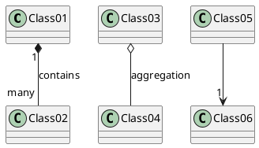
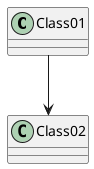
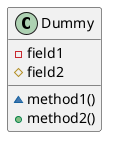
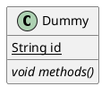
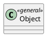
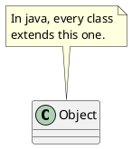
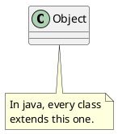
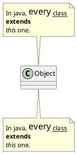
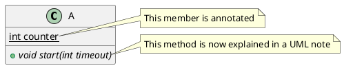

# PlantUML - 类图

## PlantUML

PlantUML是一个开源项目，可以用来快速生成各种UML图，官方文档：https://plantuml.com/zh/

可以通过[官方提供的工具](http://www.plantuml.com/plantuml/uml/SyfFKj2rKt3CoKnELR1Io4ZDoSa70000)在线生成对应的类图，本文只介绍PlantUML类图的部分常用语法。
<!--more-->

## UML类图关系

|类图关系|符号|
|:-|:-|
|依赖|`..`|
|单向关联|`<--`|
|双向关联|`--`或`<-->`|
|聚合|`0--`|
|组合|`*--`|
|泛化|`<|--`|
|实现|`<|..`|

* 箭头方向可以在左边，也可以在右边。
* `--`表示纵向的实线，`-`表示横向的实线。
* `..`表示纵向的虚线，`-`表示横向的虚线。
* 在符号两侧可以用`""`来添加对元素的说明。
* 在关系末尾可以用`:`来添加对关系的说明。


@startuml

Class01 "1" *-- "many" Class02 : contains

Class03 o-- Class04 : aggregation

Class05 --> "1" Class06

@enduml


为了避免类图生成有差错，最好把涉及到的类先声明出来；还可以用`title xxx`来给类图添加标题。：


@startuml
class Class01
class Class02
Class01 --> Class02
@enduml


还用关键字`abstract`或`abstract class`来定义抽象类，抽象类会用斜体显示。也可以使用`interface`,`annotation`和`enum`关键字。

## 添加方法、属性

使用`{}`把字段或者方法括起来，定义方法或属性时以`()`结尾来判断。

|访问权限|符号|
|:-|:-|
|public|`+`|
|protected|`#`|
|default(package private)|`~`|
|private|`-`|


@startuml
class Dummy {
 -field1
 #field2
 ~method1()
 +method2()
}
@enduml


## 抽象与静态

通过修饰符{static}或者{abstract}，可以定义静态或者抽象的方法或者属性。

这些修饰符可以写在行的开始或者结束，也可以使用{classifier}这个修饰符来代替{static}。

## 备注和模板

模板通过类关键字(`<<`和`>>`)来定义。


@startuml
class Object << general >>
@enduml


使用`note left of`,`note right of`,`note top of`,`note bottom of`这些关键字来添加备注，优点是可以自定义备注的位置，但是不能复用备注。

备注可以用`\n`来换行。


@startuml
class Object
note top of Object : In java, every class\nextends this one.
@enduml


也可以用`note "" as`来定义备注，然后用`..`将备注和类关联起来，优点是可以复用备注，但是不能自定义备注的位置。


@startuml
class Object
note "In java, every class\nextends this one." as N

Object..N
@enduml


如果想使用更多行且更复杂的备注来支持更多的样式，有下面两种方式。


@startuml
class Object

note top of Object
  In java, <size:18>every</size> <u>class</u>
  <b>extends</b>
  <i>this</i> one.
end note

note as N
  In java, <size:18>every</size> <u>class</u>
  <b>extends</b>
  <i>this</i> one.
end note

Object..N
@enduml


备注除了用于类，还可以用于类的成员和方法：

## 参考链接

* [类图的语法和功能](https://plantuml.com/zh/class-diagram)